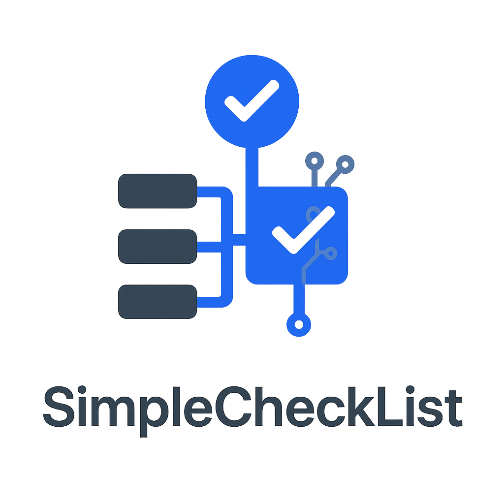

# Cursor MCP Setup Guide

<div align="center">



# Adding SimpleCheckList to Cursor IDE

**Complete guide for integrating SimpleCheckList MCP server with Cursor IDE**

</div>

## 🚀 Quick Setup

### Step 1: Start the Backend Server

First, make sure the SimpleCheckList backend is running:

```bash
# Option 1: Using Docker (Recommended)
docker run -d -p 8355:8355 mayurkakade/mcp-server:latest backend

# Option 2: Local Installation
cd /path/to/SimpleCheckList/server
npm start
```

### Step 2: Add MCP Server to Cursor

1. **Open Cursor Settings**
   - Press `Cmd/Ctrl + ,` or go to `Cursor > Settings`

2. **Navigate to MCP Settings**
   - Click on **"MCP"** in the left sidebar

3. **Add New MCP Server**
   - Click **"New MCP Server"** button

4. **Configure the Server**
   - **Server Name**: `simple-checklist`
   - **Command**: `node`
   - **Arguments**: `/Users/mayurkakade/SimpleCheckList/mcp-server/index.js` *(use your actual path)*
   - **Environment Variables**:
     - Key: `API_BASE_URL`
     - Value: `http://localhost:8355/api`

   > **Important**: Replace `/Users/mayurkakade/SimpleCheckList/mcp-server/index.js` with the actual path to your SimpleCheckList installation.

### Step 3: Save and Test

1. Click **"Save"** to add the server
2. Restart Cursor to activate the MCP server
3. Test by asking Cursor: *"Create a new project called 'Test Project'"*

## 📋 Configuration Examples

### Local Installation Configuration
```json
{
  "mcpServers": {
    "simple-checklist": {
      "command": "node",
      "args": ["/Users/mayurkakade/SimpleCheckList/mcp-server/index.js"],
      "env": {
        "API_BASE_URL": "http://localhost:8355/api"
      }
    }
  }
}
```

### Docker Configuration (Alternative - Not Recommended for Cursor)
```json
{
  "mcpServers": {
    "simple-checklist": {
      "command": "docker",
      "args": [
        "run", "--rm", "-i",
        "--network", "host",
        "mayurkakade/mcp-server:latest",
        "mcp"
      ],
      "env": {
        "API_BASE_URL": "http://localhost:8355/api"
      }
    }
  }
}
```

> **Note**: Docker configuration may have issues with Cursor. Use local Node.js configuration for best results.

## 🔧 Troubleshooting

### Common Issues

#### 1. "Server not responding"
- **Check if backend is running**: `curl http://localhost:8355/api/health`
- **Verify port availability**: Make sure port 8355 is not blocked
- **Restart Cursor**: Sometimes a restart is needed after adding MCP server

#### 2. "Command not found"
- **Check Node.js path**: Use full path to node executable
- **Verify file path**: Ensure the path to `mcp-server/index.js` is correct
- **File permissions**: Make sure the MCP server file is executable

#### 3. "Connection refused"
- **Backend not running**: Start the backend server first
- **Wrong URL**: Verify `API_BASE_URL` is `http://localhost:8355/api`
- **Port conflicts**: Check if another service is using port 8355

### Debug Steps

1. **Test Backend Directly**:
   ```bash
   curl http://localhost:8355/api/health
   # Should return: {"status":"OK","timestamp":"..."}
   ```

2. **Test MCP Server Manually**:
   ```bash
   cd /path/to/SimpleCheckList/mcp-server
   API_BASE_URL=http://localhost:8355/api node index.js
   ```

3. **Check Cursor Logs**:
   - Go to `View > Output` in Cursor
   - Select "MCP" from the dropdown
   - Look for connection errors

## 🎯 Using SimpleCheckList in Cursor

Once configured, you can use these commands in Cursor:

### Project Management
- *"Create a new project for building a React app"*
- *"List all my current projects"*
- *"Show me the progress of project [name]"*

### Task Management
- *"Add a task to implement user authentication"*
- *"Mark the login feature as completed"*
- *"Show me all high-priority tasks"*

### AI-Powered Planning
- *"Help me plan a mobile app development project"*
- *"Analyze the progress of my current project"*
- *"Break down the task 'implement payment system' into subtasks"*

## 🌐 Web UI Access

While using the MCP server in Cursor, you can also access the web interface:

```bash
# Start full-stack version
docker run -d -p 8080:80 -p 8355:8355 mayurkakade/mcp-server:latest

# Access Web UI: http://localhost:8080
# API remains available: http://localhost:8355/api
```

## 📚 Available Tools

The MCP server provides 20+ tools for comprehensive project management:

### Core Tools
- `create_project` - Create new projects
- `list_projects` - Get all projects
- `create_task` - Add tasks with metadata
- `toggle_task_completion` - Mark tasks complete
- `get_project_stats` - Get progress analytics

### AI Prompts
- `create_project_plan` - AI-assisted project planning
- `analyze_project_progress` - Intelligent progress analysis
- `suggest_task_breakdown` - Smart task decomposition
- `generate_status_report` - Comprehensive reporting

[See full tool documentation →](./MCP-SERVER-README.txt)

## 🔒 Security Notes

- The MCP server runs locally and doesn't send data externally
- All project data is stored in a local SQLite database
- API communication happens only between Cursor and your local server

## 📖 Additional Resources

- **[Main README](./README.md)** - Complete project documentation
- **[MCP Server Documentation](./MCP-SERVER-README.txt)** - Detailed MCP guide
- **[AI Agent Integration](./AI-AGENT-INTEGRATION-GUIDE.md)** - Advanced usage examples
- **[Docker Setup Guide](./DOCKER-HUB-DESCRIPTION.md)** - Docker deployment options

## 🆘 Need Help?

- **Issues**: [Create a GitHub issue](https://github.com/DevMayur/SimpleCheckList/issues)
- **Discussions**: [GitHub Discussions](https://github.com/DevMayur/SimpleCheckList/discussions)
- **Documentation**: Check our comprehensive guides above

---

<div align="center">
  <strong>Ready to supercharge your project management in Cursor? Follow the guide above!</strong>
</div>
